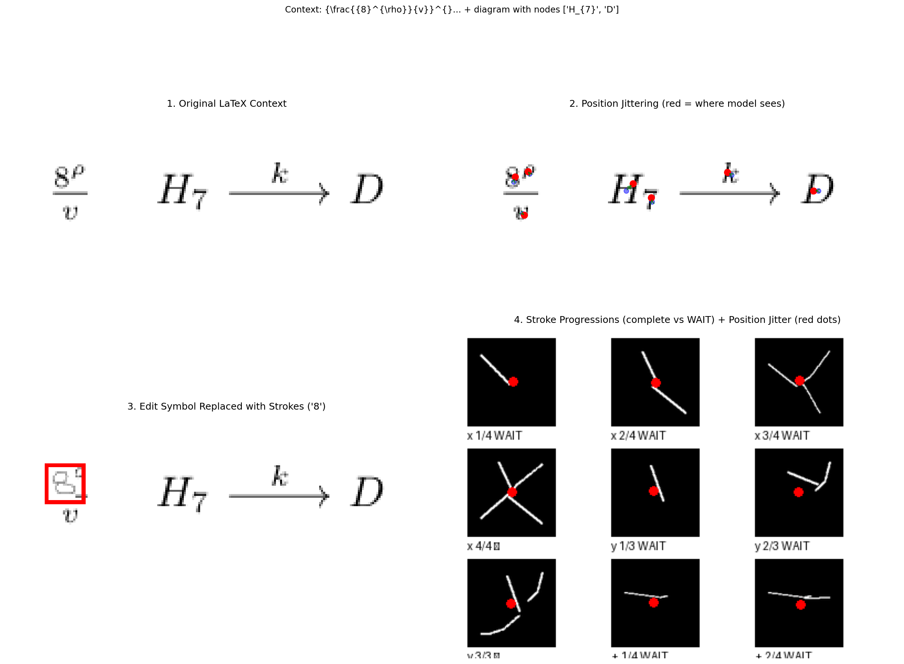

# Context Tracker: Architecture Overview

> **Real-time stroke-level LaTeX editing with reasoning trajectory capture**

---

## 0. Motivation & Design Intent

### Why This Architecture?

```
┌─────────────────────────────────────────────────────────────────────────────────┐
│                         THE PROBLEM WITH EXISTING APPROACHES                     │
├─────────────────────────────────────────────────────────────────────────────────┤
│                                                                                  │
│  TRADITIONAL VLM (Frame-wise Full Self-Attention)                               │
│  ════════════════════════════════════════════════                               │
│                                                                                  │
│   Frame 1        Frame 2        Frame 3        Frame N                          │
│  ┌───────┐      ┌───────┐      ┌───────┐      ┌───────┐                        │
│  │ image │      │ image │      │ image │      │ image │                        │
│  │ patch │      │ patch │      │ patch │      │ patch │                        │
│  │ tokens│      │ tokens│      │ tokens│      │ tokens│                        │
│  └───┬───┘      └───┬───┘      └───┬───┘      └───┬───┘                        │
│      │              │              │              │                             │
│      └──────────────┴──────────────┴──────────────┘                             │
│                          │                                                       │
│                          ▼                                                       │
│              ┌─────────────────────────┐                                        │
│              │  FULL SELF-ATTENTION    │   O(N² × P²) per inference            │
│              │  ALL patches × ALL time │   Memory: O(N × P) patches            │
│              └─────────────────────────┘   Latency: grows with history         │
│                          │                                                       │
│                          ▼                                                       │
│              ┌─────────────────────────┐                                        │
│              │     Single output       │   No edit operations                   │
│              │  (full re-recognition)  │   No reasoning trajectory             │
│              └─────────────────────────┘   No incremental updates              │
│                                                                                  │
│  PROBLEMS:                                                                       │
│  ✗ Quadratic cost: every new stroke reprocesses ALL visual history             │
│  ✗ No knowledge accumulation: treats each frame independently                  │
│  ✗ No trajectory: only captures WHAT was written, not HOW                      │
│  ✗ Edit = full re-inference: no efficient REPLACE/INSERT                       │
│                                                                                  │
└─────────────────────────────────────────────────────────────────────────────────┘

┌─────────────────────────────────────────────────────────────────────────────────┐
│                         OUR SOLUTION: CONTEXT TRACKER                            │
├─────────────────────────────────────────────────────────────────────────────────┤
│                                                                                  │
│  KEY INSIGHT: "Snowball" recognized symbols into TEXT, discard visual history  │
│  ════════════════════════════════════════════════════════════════════════════   │
│                                                                                  │
│   Stroke 1       Stroke 2       Stroke 3       Stroke N                         │
│  ┌───────┐      ┌───────┐      ┌───────┐      ┌───────┐                        │
│  │patches│      │patches│      │patches│      │patches│   Current stroke       │
│  └───┬───┘      └───┬───┘      └───┬───┘      └───┬───┘   (visual)             │
│      │              │              │              │                             │
│      ▼              ▼              ▼              ▼                             │
│  ┌───────┐      ┌───────┐      ┌───────┐      ┌───────┐                        │
│  │ [CLS] │      │ [CLS] │      │ [CLS] │      │ [CLS] │   Local recognition    │
│  └───┬───┘      └───┬───┘      └───┬───┘      └───┬───┘                        │
│      │              │              │              │                             │
│      ▼              ▼              ▼              ▼                             │
│   "x" ─────────► "x +" ───────► "x + y" ────► "x + y^{2}"                      │
│                                                                                  │
│   ▲               ▲               ▲               ▲                             │
│   │               │               │               │                             │
│   └───────────────┴───────────────┴───────────────┘                             │
│            TEXT CONTEXT (KV-cached, O(n) tokens)                                │
│            Committed symbols = COMPRESSED knowledge                             │
│                                                                                  │
│  ADVANTAGES:                                                                     │
│  ✓ Linear growth: text context O(n) vs visual history O(n × p²)                │
│  ✓ Knowledge accumulation: each symbol COMMITTED to symbolic form              │
│  ✓ Trajectory captured: sequence of [ADD, REPLACE, DELETE] operations          │
│  ✓ O(1) edits: REPLACE only recomputes current stroke + [INT]                  │
│                                                                                  │
└─────────────────────────────────────────────────────────────────────────────────┘
```

### Core Design Principles

| Principle | Implementation | Benefit |
|-----------|---------------|---------|
| **Symbolic Commitment** | Recognized strokes → text tokens | Memory: O(n) vs O(n×p²) |
| **Sparse Attention** | Causal on text, isolated patches | Compute: 60-70% savings |
| **Dual-Token Separation** | [CLS]=visual, [INT]=semantic | Clean feature spaces |
| **Incremental KV-Cache** | Text cached, patches ephemeral | O(1) edit operations |
| **Trajectory Logging** | Edit operations as first-class | Reasoning path capture |

### Reasoning Trajectory & Knowledge Graph Alignment

```
┌─────────────────────────────────────────────────────────────────────────────────┐
│                    BEYOND OCR: REASONING TRAJECTORY CAPTURE                      │
├─────────────────────────────────────────────────────────────────────────────────┤
│                                                                                  │
│  Traditional OCR captures:     Context Tracker captures:                        │
│  ═════════════════════════     ═════════════════════════                        │
│                                                                                  │
│  • Final expression            • Final expression                               │
│    "x² + 2x + 1 = 0"            "x² + 2x + 1 = 0"                              │
│                                                                                  │
│                                • HOW it was constructed:                        │
│                                  t=0: ADD "x"                                   │
│                                  t=1: ADD "²"     ──┐                           │
│                                  t=2: ADD "+"       │ Trajectory                │
│                                  t=3: ADD "2x"      │ embedding                 │
│                                  t=4: PAUSE 3s    ──┤                           │
│                                  t=5: ADD "+1"      │ → Knowledge               │
│                                  t=6: ADD "=0"      │    graph node             │
│                                  t=7: DELETE "=0" ──┘    alignment              │
│                                  t=8: WRAP "(...)²"                             │
│                                                                                  │
│  KNOWLEDGE GRAPH MODELING:                                                      │
│  ═════════════════════════                                                      │
│                                                                                  │
│  Edit trajectory ──────► Trajectory encoder ──────► KG node prediction         │
│                                │                                                │
│                                ▼                                                │
│                    ┌─────────────────────────┐                                  │
│                    │  "quadratic_equation"   │                                  │
│                    │         │               │                                  │
│                    │    ┌────┴────┐          │                                  │
│                    │    ▼         ▼          │                                  │
│                    │ "factoring" "formula"   │                                  │
│                    │    │                    │                                  │
│                    │    ▼                    │                                  │
│                    │ "(x+1)²=0" ◄── user's trajectory suggests this path       │
│                    └─────────────────────────┘                                  │
│                                                                                  │
│  APPLICATIONS:                                                                  │
│  • Tutoring hints (without giving answers)                                      │
│  • Misconception detection (from hesitation/correction patterns)                │
│  • Learning analytics (problem-solving strategy identification)                 │
│  • Collaborative math (real-time shared derivations)                            │
│                                                                                  │
└─────────────────────────────────────────────────────────────────────────────────┘
```

### Attention Pattern Philosophy

```
┌─────────────────────────────────────────────────────────────────────────────────┐
│                    ATTENTION DESIGN: WHY SPARSE + DUAL-TOKEN?                    │
├─────────────────────────────────────────────────────────────────────────────────┤
│                                                                                  │
│  FULL SELF-ATTENTION (BERT-style VLM):                                          │
│  ═════════════════════════════════════                                          │
│                                                                                  │
│       Every token attends to every other token                                  │
│       ┌─────────────────────────────────────┐                                   │
│       │ ■ ■ ■ ■ ■ ■ ■ ■ ■ ■ ■ ■ ■ ■ ■ ■ │   Cost: O(N²)                       │
│       │ ■ ■ ■ ■ ■ ■ ■ ■ ■ ■ ■ ■ ■ ■ ■ ■ │   N = text + patches                 │
│       │ ■ ■ ■ ■ ■ ■ ■ ■ ■ ■ ■ ■ ■ ■ ■ ■ │                                      │
│       │ ■ ■ ■ ■ ■ ■ ■ ■ ■ ■ ■ ■ ■ ■ ■ ■ │   Problem:                           │
│       │ ■ ■ ■ ■ ■ ■ ■ ■ ■ ■ ■ ■ ■ ■ ■ ■ │   • Visual features DILUTED         │
│       │ ■ ■ ■ ■ ■ ■ ■ ■ ■ ■ ■ ■ ■ ■ ■ ■ │     by attending to text            │
│       └─────────────────────────────────────┘   • No KV-cache on edits         │
│                                                                                  │
│  OUR SPARSE + DUAL-TOKEN DESIGN:                                                │
│  ═══════════════════════════════                                                │
│                                                                                  │
│       Structured sparsity with role separation                                  │
│       ┌─────────────────────────────────────┐                                   │
│       │ ■ ■ ■ · · · · · · · · · │ text     │   Text: causal (O(n²/2))          │
│       │ ■ ■ ■ · · · · · · · · · │ context  │                                    │
│       │ ■ ■ ■ · · · · · · · · · │          │   Patches: isolated group          │
│       │ · · · ■ ■ ■ · · · · · · │ patches  │   (O(p²), no text dilution)        │
│       │ · · · ■ ■ ■ · · · · · · │          │                                    │
│       │ · · · ■ ■ ■ · · · · · · │          │   [CLS]: patches only              │
│       │ · · · ■ ■ ■ ■ · · · · · │ [CLS]    │   (pure visual aggregation)        │
│       │ ■ ■ ■ · · · ■ ■ · · · · │ [INT]    │                                    │
│       │ ■ ■ ■ · · · ■ ■ ■ · · · │ decode   │   [INT]: text + [CLS]              │
│       └─────────────────────────────────────┘   (semantic reasoning)            │
│                                                                                  │
│       Cost: O(n²/2 + p² + n) ≈ 35% of full attention                           │
│       Benefit: Visual purity + O(1) edit capability                            │
│                                                                                  │
└─────────────────────────────────────────────────────────────────────────────────┘
```

### Cumulative Cost Analysis: Full Session

The critical insight is that we process **multiple strokes per session**. The cumulative cost difference is dramatic:

```
┌─────────────────────────────────────────────────────────────────────────────────┐
│                    CUMULATIVE COST: Σ(per-stroke cost) OVER SESSION              │
├─────────────────────────────────────────────────────────────────────────────────┤
│                                                                                  │
│  USER WRITES n STROKES (typical: n = 14-50 for one expression)                  │
│  Each stroke adds ~p patches (p ≈ 16) and ~t text tokens (t ≈ 2-3)             │
│                                                                                  │
│  ════════════════════════════════════════════════════════════════════════════   │
│                                                                                  │
│  FULL SELF-ATTENTION (re-encode everything each stroke):                        │
│  ──────────────────────────────────────────────────────                         │
│                                                                                  │
│    Stroke 1: (p)² = p²                     (just patches)                       │
│    Stroke 2: (2p)² = 4p²                   (all patches so far)                 │
│    Stroke 3: (3p)² = 9p²                                                        │
│    ...                                                                           │
│    Stroke n: (np)² = n²p²                                                       │
│                                                                                  │
│    Total = Σᵢ₌₁ⁿ (ip)² = p² × Σᵢ₌₁ⁿ i² = p² × n(n+1)(2n+1)/6                  │
│                                                                                  │
│          ≈ p² × n³/3  =  O(n³)                                                  │
│                                                                                  │
│    For n=20 strokes, p=16: ≈ 16² × 20³/3 = 256 × 2667 ≈ 683,000 ops           │
│                                                                                  │
│  ════════════════════════════════════════════════════════════════════════════   │
│                                                                                  │
│  OUR SPARSE DESIGN (incremental, text committed):                               │
│  ────────────────────────────────────────────────                               │
│                                                                                  │
│    Stroke 1: p² + t           (patches + 1 text token, then commit)            │
│    Stroke 2: p² + 2t          (new patches + growing text context)             │
│    Stroke 3: p² + 3t                                                            │
│    ...                                                                           │
│    Stroke n: p² + nt                                                            │
│                                                                                  │
│    Total = Σᵢ₌₁ⁿ (p² + it) = np² + t × Σᵢ₌₁ⁿ i = np² + t × n(n+1)/2           │
│                                                                                  │
│          ≈ np² + tn²/2  =  O(n²)                                                │
│                                                                                  │
│    For n=20 strokes, p=16, t=3: ≈ 20×256 + 3×400/2 = 5120 + 600 ≈ 5,700 ops   │
│                                                                                  │
│  ════════════════════════════════════════════════════════════════════════════   │
│                                                                                  │
│  COMPARISON:                                                                     │
│  ───────────                                                                     │
│                                                                                  │
│    Full attention:  683,000 ops   (O(n³))                                       │
│    Our sparse:        5,700 ops   (O(n²))                                       │
│                                                                                  │
│    SAVINGS: 99.2% reduction!  (120× fewer operations)                           │
│                                                                                  │
│  ════════════════════════════════════════════════════════════════════════════   │
│                                                                                  │
│  WITH KV-CACHE (text context cached):                                           │
│  ────────────────────────────────────                                           │
│                                                                                  │
│    Each stroke only computes:                                                   │
│      • New patches: p² (constant)                                               │
│      • [CLS] → patches: p (constant)                                            │
│      • [INT] → text + CLS: n + 1 (linear)                                       │
│      • AR decode: ~d tokens                                                     │
│                                                                                  │
│    Total = Σᵢ₌₁ⁿ (p² + p + i + d) ≈ n(p² + p + d) + n²/2                       │
│                                                                                  │
│          =  O(n²)  but with MUCH smaller constants                              │
│                                                                                  │
│    For n=20: ≈ 20×(256+16+5) + 200 ≈ 5,740 ops                                 │
│                                                                                  │
└─────────────────────────────────────────────────────────────────────────────────┘
```

### Visual: Cost Growth Comparison

```
┌─────────────────────────────────────────────────────────────────────────────────┐
│  CUMULATIVE COST vs NUMBER OF STROKES                                            │
├─────────────────────────────────────────────────────────────────────────────────┤
│                                                                                  │
│  Cost (log scale)                                                               │
│     │                                                                            │
│  10⁷│                                              ╱ Full Attention             │
│     │                                           ╱    Σi² = O(n³)                │
│  10⁶│                                        ╱                                  │
│     │                                     ╱                                     │
│  10⁵│                                  ╱                                        │
│     │                               ╱            ·····                          │
│  10⁴│                            ╱         ·····     Our Sparse                 │
│     │                         ╱       ·····          O(n²)                      │
│  10³│                      ╱     ·····                                          │
│     │                   ╱   ·····                                               │
│  10²│                ╱ ·····                                                    │
│     │             ╱····                                                         │
│  10¹│          ╱···                                                             │
│     │       ····                                                                 │
│     └────────────────────────────────────────────────────────────────           │
│          5      10      15      20      25      30      35      40              │
│                         Number of strokes (n)                                   │
│                                                                                  │
│  At n=20:  Full = 683K ops,  Sparse = 5.7K ops  (120× faster)                  │
│  At n=40:  Full = 5.5M ops,  Sparse = 23K ops   (240× faster)                  │
│                                                                                  │
│  The gap WIDENS as expressions get longer!                                      │
│                                                                                  │
└─────────────────────────────────────────────────────────────────────────────────┘
```

### Summary: Complexity Classes

| Approach | Per-Stroke | Cumulative (n strokes) | n=20 | n=40 |
|----------|------------|------------------------|------|------|
| **Full self-attention** | O((i·p)²) | **Σi² = O(n³)** | 683K | 5.5M |
| **Our sparse (no cache)** | O(p² + i·t) | **O(n²)** | 5.7K | 23K |
| **Our sparse (KV-cache)** | O(p² + i) | **O(n²)** | 5.7K | 23K |
| **Speedup** | | | **120×** | **240×** |

The **O(n³) → O(n²)** reduction comes from:
1. **Not re-encoding visual history**: patches processed once, then committed to text
2. **Sparse attention**: causal on text, isolated on patches
3. **KV-cache**: text context cached, only new tokens computed

### Practical Implementation: Canvas Storage + Local Re-Embedding

```
┌─────────────────────────────────────────────────────────────────────────────────┐
│                    IMPLEMENTATION: DUAL STORAGE ARCHITECTURE                     │
├─────────────────────────────────────────────────────────────────────────────────┤
│                                                                                  │
│  ┌─────────────────────────────────────────────────────────────────────────┐    │
│  │                         USER'S DRAWING CANVAS                            │    │
│  │                    (Persistent Visual Ground Truth)                      │    │
│  │  ┌─────────────────────────────────────────────────────────────────┐    │    │
│  │  │                                                                  │    │    │
│  │  │      ╱╲         ┌───┐                                           │    │    │
│  │  │     ╱  ╲    +   │ 2 │   +   y   =   5                           │    │    │
│  │  │    ╳    ╳       └───┘                                           │    │    │
│  │  │     ╲  ╱          ↑                                             │    │    │
│  │  │      ╲╱      (superscript)                                      │    │    │
│  │  │       x                                                          │    │    │
│  │  │                                                                  │    │    │
│  │  │   Strokes stored as: [(x,y,t), ...] per symbol                  │    │    │
│  │  │   Bounding boxes: {sym_id: (x1,y1,x2,y2)}                       │    │    │
│  │  │                                                                  │    │    │
│  │  └─────────────────────────────────────────────────────────────────┘    │    │
│  └─────────────────────────────────────────────────────────────────────────┘    │
│                                        │                                         │
│                                        │ Recognition                             │
│                                        ▼                                         │
│  ┌─────────────────────────────────────────────────────────────────────────┐    │
│  │                         MODEL'S TEXT CONTEXT                             │    │
│  │                    (Compressed Symbolic Form)                            │    │
│  │                                                                          │    │
│  │   tokens: ["x", "^{", "2", "}", "+", "y", "=", "5"]                      │    │
│  │   positions: [{bbox, sym_id}, {bbox, sym_id}, ...]                       │    │
│  │                                                                          │    │
│  │   KV-cache: [k₁,v₁], [k₂,v₂], ..., [k₈,v₈]                              │    │
│  │                                                                          │    │
│  │   ✓ Patch embeddings: REMOVED (not needed after recognition)            │    │
│  │   ✓ Bounding boxes: KEPT (for spatial alignment on re-edit)             │    │
│  │   ✓ KV-cache: KEPT (for efficient context lookup)                       │    │
│  │                                                                          │    │
│  └─────────────────────────────────────────────────────────────────────────┘    │
│                                                                                  │
└─────────────────────────────────────────────────────────────────────────────────┘

┌─────────────────────────────────────────────────────────────────────────────────┐
│                    EDIT OPERATION: LOCAL RE-EMBEDDING                            │
├─────────────────────────────────────────────────────────────────────────────────┤
│                                                                                  │
│  User draws new stroke over "2" to change it to "3":                            │
│                                                                                  │
│  STEP 1: Detect edit region via 2D position                                     │
│  ─────────────────────────────────────────────                                  │
│                                                                                  │
│      Canvas:          New stroke bbox: (45, 5, 55, 20)                          │
│      ┌────────────────────────────────────┐                                     │
│      │      x²  + y = 5                   │                                     │
│      │       ↑                            │                                     │
│      │    [edit region]                   │  Overlaps with "2" bbox             │
│      │    (45,5)───(55,5)                │  → REPLACE operation detected        │
│      │      │         │                   │                                     │
│      │    (45,20)──(55,20)               │                                     │
│      └────────────────────────────────────┘                                     │
│                                                                                  │
│  STEP 2: Crop LOCAL region (not entire canvas!)                                 │
│  ──────────────────────────────────────────────                                 │
│                                                                                  │
│      ┌─────────────┐                                                            │
│      │   x    3    │  ← Small crop around edit area                            │
│      │    ╲   ╱╲   │    May include neighboring "x" for context                │
│      │     ╳   ╲╱  │    (but NOT the entire "x² + y = 5")                      │
│      └─────────────┘                                                            │
│                                                                                  │
│      Crop size: ~2× edit bbox (include spatial context)                        │
│      Patches extracted: p ≈ 16 (constant, regardless of expression length!)    │
│                                                                                  │
│  STEP 3: Model sees ONLY local patches + full text context                      │
│  ─────────────────────────────────────────────────────────                      │
│                                                                                  │
│      Input to model:                                                            │
│      ┌────────────────────────────────────────────────────────────┐            │
│      │ Text Context (cached)  │ Local Patches │ [CLS] │ [INT]    │            │
│      │ "x" "^{" "2" "}" "+"   │ [P₀]..[P₁₅]   │       │          │            │
│      │ "y" "=" "5"            │ (edit region) │       │          │            │
│      └────────────────────────────────────────────────────────────┘            │
│                                                                                  │
│      Model does NOT see: patches for "x", "+", "y", "=", "5"                   │
│      Model DOES see: text tokens for full context (KV-cached)                  │
│                                                                                  │
│  STEP 4: Output and update                                                      │
│  ─────────────────────────────                                                  │
│                                                                                  │
│      Output: [REPLACE] [pos=2] "3" [EOS]                                        │
│                                                                                  │
│      Update text context: ["x", "^{", "3", "}", "+", "y", "=", "5"]            │
│      Update canvas: keep "3" strokes, mark "2" as replaced                     │
│      Update KV-cache: only recompute k₃,v₃ (position 2)                        │
│                                                                                  │
└─────────────────────────────────────────────────────────────────────────────────┘
```

### Why Local Cropping Works

| Aspect | Full Canvas Embedding | Local Edit Crop (Ours) |
|--------|----------------------|------------------------|
| **Patches per edit** | O(total_symbols × p) | O(p) constant |
| **What model sees** | Everything (redundant) | Edit region + text context |
| **Visual quality** | Diluted by irrelevant areas | Focused on edit |
| **Latency** | Grows with expression | **Constant ~10ms** |

### Data Flow Summary

```
┌─────────────────────────────────────────────────────────────────────────────────┐
│                    MODEL INPUT: ALWAYS SMALL + CONTEXTUAL                        │
├─────────────────────────────────────────────────────────────────────────────────┤
│                                                                                  │
│  WHAT MODEL SEES:                                                               │
│  ════════════════                                                               │
│                                                                                  │
│  ┌──────────────────────────────────────────────────────────────────────────┐  │
│  │                                                                           │  │
│  │   TEXT CONTEXT              LOCAL PATCHES           SPECIAL TOKENS       │  │
│  │   (full expression)         (edit region only)      (aggregation)        │  │
│  │                                                                           │  │
│  │   "x" "^{" "2" "}" "+"      ┌─────────────┐         [CLS] [INT]          │  │
│  │   "y" "=" "5"               │ ╱╲  (new 3) │                              │  │
│  │        │                    │ ╲╱          │              │               │  │
│  │        │                    └─────────────┘              │               │  │
│  │        │                          │                      │               │  │
│  │        │ KV-cached                │ Fresh patches        │ Compute       │  │
│  │        │ (O(1) lookup)            │ (O(p²) attention)    │ output        │  │
│  │        │                          │                      │               │  │
│  │        └──────────────────────────┴──────────────────────┘               │  │
│  │                                   │                                       │  │
│  │                                   ▼                                       │  │
│  │                          [REPLACE] [pos=2] "3"                           │  │
│  │                                                                           │  │
│  └──────────────────────────────────────────────────────────────────────────┘  │
│                                                                                  │
│  WHAT MODEL NEVER SEES (on edit):                                               │
│  ════════════════════════════════                                               │
│                                                                                  │
│  ✗ Patch embeddings for already-recognized symbols                             │
│  ✗ Full canvas re-rendering                                                    │
│  ✗ Historical stroke trajectories                                              │
│                                                                                  │
│  WHAT'S STORED BUT NOT EMBEDDED:                                                │
│  ═══════════════════════════════                                                │
│                                                                                  │
│  Canvas DB:                                                                     │
│  ├─ symbol_id: "sym_001"                                                       │
│  │  ├─ strokes: [[(x,y,t), ...], ...]    (for re-rendering/export)            │
│  │  ├─ bbox: (10, 15, 30, 45)            (for edit detection)                 │
│  │  ├─ text_token: "x"                   (committed recognition)              │
│  │  └─ context_pos: 0                    (position in text sequence)          │
│  ├─ symbol_id: "sym_002"                                                       │
│  │  └─ ...                                                                     │
│  └─ ...                                                                        │
│                                                                                  │
│  This allows:                                                                   │
│  • Undo/redo (restore strokes from canvas)                                     │
│  • Export to SVG/PDF (original stroke data)                                    │
│  • Re-recognition if user disputes (re-embed from canvas)                      │
│  • Spatial edit detection (bbox overlap check)                                 │
│                                                                                  │
└─────────────────────────────────────────────────────────────────────────────────┘
```

---

## 0.7 SOTA Comparison & Novelty Analysis

Based on review of current state-of-the-art methods (December 2024):

```
┌─────────────────────────────────────────────────────────────────────────────────┐
│                    SOTA LANDSCAPE: WHERE WE FIT                                  │
├─────────────────────────────────────────────────────────────────────────────────┤
│                                                                                  │
│  ┌─────────────────────────────────────────────────────────────────────────┐    │
│  │                     OFFLINE / BATCH PROCESSING                           │    │
│  │  ═══════════════════════════════════════════════                        │    │
│  │                                                                          │    │
│  │  DeepSeek-OCR (2024):                                                   │    │
│  │  • "Optical compression" → vision tokens (10× compression, 97% acc)     │    │
│  │  • Full image → encoder → compressed tokens → decoder → text            │    │
│  │  • Batch processing, no incremental updates                             │    │
│  │                                                                          │    │
│  │  Qwen-VL / Qwen2.5-VL (Alibaba):                                        │    │
│  │  • Vision encoder + LLM backbone                                        │    │
│  │  • Full self-attention on all patches + text                            │    │
│  │  • Excellent multilingual OCR, complex layouts                          │    │
│  │  • Batch processing, full re-inference on any change                    │    │
│  │                                                                          │    │
│  │  TIPS (DeepMind):                                                       │    │
│  │  • Spatial-aware image-text pretraining                                 │    │
│  │  • Synthetic descriptions for dense vision tasks                        │    │
│  │  • Not designed for incremental/real-time scenarios                     │    │
│  │                                                                          │    │
│  │  HMER (TAMER, CoMER, PosFormer):                                        │    │
│  │  • Full expression image → encoder → decoder → LaTeX                    │    │
│  │  • Tree-aware / coverage / position forest structures                   │    │
│  │  • Offline recognition only, no editing                                 │    │
│  │                                                                          │    │
│  └─────────────────────────────────────────────────────────────────────────┘    │
│                                                                                  │
│  ┌─────────────────────────────────────────────────────────────────────────┐    │
│  │                     ONLINE / INCREMENTAL PROCESSING                      │    │
│  │  ═══════════════════════════════════════════════                        │    │
│  │                                                                          │    │
│  │  InkSight (Google 2024):                                                │    │
│  │  • Stroke coordinates (x, y, t) → ink tokenizer → decoder              │    │
│  │  • Online processing of stroke sequences                                │    │
│  │  • Coordinate-based (no visual patches)                                 │    │
│  │  • No explicit edit operations (ADD/REPLACE/INSERT)                     │    │
│  │                                                                          │    │
│  │  MyScript / Mathpix (Commercial):                                       │    │
│  │  • Real-time recognition with gesture editing                           │    │
│  │  • Proprietary architecture (black box)                                 │    │
│  │  • Has editing but mechanism undisclosed                                │    │
│  │                                                                          │    │
│  │  Traditional Online HMER (GRU-based):                                   │    │
│  │  • (x, y, t) sequences → RNN encoder → decoder                          │    │
│  │  • No visual patch features, just coordinates                           │    │
│  │  • No KV-cache, no edit operations                                      │    │
│  │                                                                          │    │
│  └─────────────────────────────────────────────────────────────────────────┘    │
│                                                                                  │
│  ┌─────────────────────────────────────────────────────────────────────────┐    │
│  │                     OURS: CONTEXT TRACKER                                │    │
│  │  ═════════════════════════════════════                                  │    │
│  │                                                                          │    │
│  │  • Stroke patches (visual) + text context (symbolic)                    │    │
│  │  • Sparse attention: causal on text, isolated on patches                │    │
│  │  • Dual-token [CLS]+[INT] for separated concerns                        │    │
│  │  • Symbolic commitment: patches → text, then discard                    │    │
│  │  • O(1) edit via KV-cache + local re-embedding                          │    │
│  │  • Reasoning trajectory as first-class output                           │    │
│  │                                                                          │    │
│  └─────────────────────────────────────────────────────────────────────────┘    │
│                                                                                  │
└─────────────────────────────────────────────────────────────────────────────────┘
```

### Detailed Technical Comparison

| Aspect | DeepSeek-OCR | Qwen-VL | InkSight | MyScript | **Ours** |
|--------|--------------|---------|----------|----------|----------|
| **Input** | Full image | Full image | Stroke coords | Strokes | **Stroke patches** |
| **Attention** | Compressed dense | Full dense | RNN-based | Unknown | **Sparse (causal + isolated)** |
| **Context repr** | Vision tokens | All patches | Coord embeddings | Unknown | **Text tokens (committed)** |
| **Edit operation** | Full re-infer | Full re-infer | None explicit | Proprietary | **O(1) via KV-cache** |
| **Memory scaling** | O(compressed) | O(patches) | O(strokes) | Unknown | **O(text tokens)** |
| **Trajectory** | ❌ | ❌ | ❌ | ❌ | **✅ Logged** |
| **Real-time** | ❌ Batch | ❌ Batch | ✅ Online | ✅ Online | **✅ Online** |
| **Open source** | ✅ | ✅ | ✅ | ❌ | **✅ (proposed)** |

### Novelty Analysis: What's Unique to Us?

```
┌─────────────────────────────────────────────────────────────────────────────────┐
│                    NOVELTY ASSESSMENT                                            │
├─────────────────────────────────────────────────────────────────────────────────┤
│                                                                                  │
│  ✅ CLEARLY NOVEL (No direct prior work found):                                 │
│  ────────────────────────────────────────────                                   │
│                                                                                  │
│  1. Dual-Token [CLS]+[INT] Architecture                                         │
│     • [CLS] isolated to patches (pure visual)                                   │
│     • [INT] sees text + [CLS] (semantic reasoning)                              │
│     • Existing VLMs use single pooling or full cross-attention                  │
│                                                                                  │
│  2. Symbolic Commitment Strategy                                                │
│     • Recognized strokes → text tokens, patches DISCARDED                       │
│     • Existing methods keep all visual history or use compression               │
│     • Our approach: O(text) memory vs O(patches) or O(compressed)               │
│                                                                                  │
│  3. O(1) Edit Operations via Selective KV-Cache                                 │
│     • REPLACE: only recompute local patches + [INT]                             │
│     • Existing VLMs require full re-inference on any edit                       │
│     • Even DeepSeek-OCR's compression doesn't enable O(1) edits                 │
│                                                                                  │
│  4. Reasoning Trajectory as First-Class Output                                  │
│     • Edit sequence (ADD/REPLACE/DELETE) logged with timestamps                 │
│     • Alignable to knowledge graphs, tutoring hints                             │
│     • No existing OCR/HMER system captures HOW user wrote                       │
│                                                                                  │
│  5. Local Crop Re-Embedding on Edit                                             │
│     • Only re-embed edit region, not full canvas                                │
│     • Combined with text context for full understanding                         │
│     • Novel hybrid of local visual + global symbolic                            │
│                                                                                  │
│  ────────────────────────────────────────────                                   │
│  ⚠️ SIMILAR CONCEPTS EXIST (But our application is novel):                      │
│  ────────────────────────────────────────────                                   │
│                                                                                  │
│  6. Sparse Attention Patterns                                                   │
│     • Causal masking well-known (GPT, etc.)                                     │
│     • BUT: our specific pattern (isolated patches + causal text) is novel       │
│     • DeepSeek uses compression, not structured sparsity                        │
│                                                                                  │
│  7. 2D Positional Encoding                                                      │
│     • 2D RoPE exists in some vision models                                      │
│     • Our application to edit localization (superscript vs adjacent) may be new │
│                                                                                  │
│  8. Multimodal Fusion (Text + Visual)                                           │
│     • Common in VLMs (Qwen-VL, LLaVA, etc.)                                     │
│     • BUT: our text is COMMITTED recognition, not input text                    │
│     • The "snowball" incremental fusion is novel                                │
│                                                                                  │
│  ────────────────────────────────────────────                                   │
│  ❌ NOT NOVEL (Already well-established):                                        │
│  ────────────────────────────────────────────                                   │
│                                                                                  │
│  9. Autoregressive Decoding                                                     │
│     • Standard in all LLM-based OCR                                             │
│                                                                                  │
│  10. Patch Embedding for Vision                                                 │
│      • Standard since ViT (2020)                                                │
│                                                                                  │
│  11. KV-Cache for Efficient Inference                                           │
│      • Standard in all transformer decoders                                     │
│      • Our SELECTIVE update strategy is the novel part                          │
│                                                                                  │
└─────────────────────────────────────────────────────────────────────────────────┘
```

### Academic Contribution Summary

| Contribution Area | Novelty Level | Venue Fit |
|-------------------|---------------|-----------|
| **Dual-token [CLS]+[INT] for O(1) edits** | ⭐⭐⭐ High | NeurIPS/ICML (architecture) |
| **Symbolic commitment (patch → text)** | ⭐⭐⭐ High | CVPR/ICCV (efficient VLM) |
| **Reasoning trajectory capture** | ⭐⭐⭐ High | AAAI/IUI (AI + education) |
| **Local crop + global text hybrid** | ⭐⭐ Medium | ECCV (document understanding) |
| **Sparse attention for HMER** | ⭐⭐ Medium | ACL (efficient multimodal) |
| **2D RoPE for edit localization** | ⭐ Incremental | Workshop paper |

### Key Differentiator Statement

> **What no existing system does:**
> 
> Existing methods either (a) process full images in batch mode (DeepSeek-OCR, Qwen-VL, HMER), 
> or (b) process stroke coordinates without visual patches (InkSight, GRU-based).
> 
> **Context Tracker uniquely combines:**
> 1. Visual patch features (shape recognition)
> 2. Incremental text context (symbolic knowledge)
> 3. O(1) edit capability (practical real-time)
> 4. Reasoning trajectory (cognitive insight)
> 
> This combination addresses a gap: **real-time interactive math editing with reasoning capture**.

---

## 1. System Overview

```
┌─────────────────────────────────────────────────────────────────────────────────┐
│                         CONTEXT TRACKER PIPELINE                                 │
├─────────────────────────────────────────────────────────────────────────────────┤
│                                                                                  │
│   USER INPUT                    PROCESSING                      OUTPUT          │
│   ══════════                    ══════════                      ══════          │
│                                                                                  │
│   ┌─────────┐                                                                   │
│   │ Stroke 1│────┐                                                              │
│   └─────────┘    │         ┌──────────────────────┐                            │
│   ┌─────────┐    │         │                      │         ┌──────────────┐   │
│   │ Stroke 2│────┼────────►│  Dual-Token Model    │────────►│ LaTeX: x^{2} │   │
│   └─────────┘    │         │  [CLS] + [INT]       │         └──────────────┘   │
│   ┌─────────┐    │         │                      │                ▼           │
│   │ Stroke 3│────┘         └──────────────────────┘         ┌──────────────┐   │
│   └─────────┘                       ▲                       │ Edit: ADD    │   │
│        │                            │                       │ Position: 3  │   │
│        ▼                     ┌──────┴──────┐                └──────────────┘   │
│   ┌─────────────┐            │             │                       ▼           │
│   │ Text Context│────────────┘     KV-Cache                 ┌──────────────┐   │
│   │ "x + y"     │              (incremental)                │ Reasoning    │   │
│   └─────────────┘                                           │ Trajectory   │   │
│                                                             └──────────────┘   │
│                                                                                  │
└─────────────────────────────────────────────────────────────────────────────────┘
```

---

## 2. Input Sequence Format

### Token Sequence Structure

```
┌─────────────────────────────────────────────────────────────────────────────────┐
│  INPUT SEQUENCE (Single Forward Pass)                                            │
├─────────────────────────────────────────────────────────────────────────────────┤
│                                                                                  │
│  ┌─────────────────────┬─────┬──────────────────────┬─────┬─────┬────────────┐ │
│  │   LaTeX Context     │ SEP │   Stroke Patches     │ CLS │ INT │ AR Decode  │ │
│  ├─────────────────────┼─────┼──────────────────────┼─────┼─────┼────────────┤ │
│  │ "x" "+" "y" "^{" "2"│ [S] │ [P₀][P₁][P₂]...[Pₖ] │ [C] │ [I] │ [e₁]..[EOS]│ │
│  │       "}" "="       │     │                      │     │     │            │ │
│  └─────────────────────┴─────┴──────────────────────┴─────┴─────┴────────────┘ │
│           │                           │                │     │        │        │
│           │                           │                │     │        │        │
│      Committed                   Current            Local  Global   Edit      │
│      symbols                     stroke             recog  reason   output    │
│      (text)                      (visual)                                      │
│                                                                                  │
│  EXAMPLE:                                                                        │
│  ════════                                                                        │
│  User has written "x + y" and now draws "²" above y                             │
│                                                                                  │
│  Input:  <x> <+> <y> [SEP] [P₀][P₁][P₂][P₃] [CLS] [INT]                        │
│  Output: [ADD] <^{> <2> <}> [EOS]                                               │
│                                                                                  │
│  Result: "x + y^{2}"                                                            │
│                                                                                  │
└─────────────────────────────────────────────────────────────────────────────────┘
```

### Concrete Examples

```
┌─────────────────────────────────────────────────────────────────────────────────┐
│  EXAMPLE 1: Adding Superscript                                                   │
├─────────────────────────────────────────────────────────────────────────────────┤
│                                                                                  │
│  Before: x + y          User draws: ²          After: x + y^{2}                 │
│                                                                                  │
│  Input Tokens:                                                                   │
│  ┌───┬───┬───┬─────┬────┬────┬────┬────┬─────┬─────┐                           │
│  │ x │ + │ y │[SEP]│ P₀ │ P₁ │ P₂ │ P₃ │[CLS]│[INT]│                           │
│  └───┴───┴───┴─────┴────┴────┴────┴────┴─────┴─────┘                           │
│    ↑   ↑   ↑          ↑    ↑    ↑    ↑     ↑     ↑                              │
│   text context       stroke patches      dual tokens                            │
│                                                                                  │
│  Output: [ADD] [^{] [2] [}] [EOS]                                               │
│                                                                                  │
└─────────────────────────────────────────────────────────────────────────────────┘

┌─────────────────────────────────────────────────────────────────────────────────┐
│  EXAMPLE 2: Replacing Symbol                                                     │
├─────────────────────────────────────────────────────────────────────────────────┤
│                                                                                  │
│  Before: x^{2}          User draws: 3          After: x^{3}                     │
│          (over the 2)                                                           │
│                                                                                  │
│  Input Tokens:                                                                   │
│  ┌───┬────┬───┬───┬─────┬────┬────┬────┬─────┬─────┐                           │
│  │ x │ ^{ │ 2 │ } │[SEP]│ P₀ │ P₁ │ P₂ │[CLS]│[INT]│                           │
│  └───┴────┴───┴───┴─────┴────┴────┴────┴─────┴─────┘                           │
│                                                                                  │
│  Output: [REPLACE] [pos=2] [3] [EOS]                                            │
│          (replace token at position 2)                                          │
│                                                                                  │
└─────────────────────────────────────────────────────────────────────────────────┘

┌─────────────────────────────────────────────────────────────────────────────────┐
│  EXAMPLE 3: Incomplete Stroke (WAIT)                                             │
├─────────────────────────────────────────────────────────────────────────────────┤
│                                                                                  │
│  User drawing "α" but only 2 of 3 strokes complete                              │
│                                                                                  │
│  Input Tokens:                                                                   │
│  ┌───┬───┬─────┬────┬────┬─────┬─────┐                                         │
│  │ x │ + │[SEP]│ P₀ │ P₁ │[CLS]│[INT]│    (partial strokes)                    │
│  └───┴───┴─────┴────┴────┴─────┴─────┘                                         │
│                                                                                  │
│  Output: [WAIT]                                                                  │
│          (model recognizes incomplete symbol, waits for more strokes)           │
│                                                                                  │
└─────────────────────────────────────────────────────────────────────────────────┘
```

---

## 3. Attention Pattern Designs

We propose **two experimental attention patterns** to compare:

### Option A: Isolated Patches (Dual-Token Design)

**Philosophy**: Keep visual processing pure. [CLS] focuses only on stroke recognition, [INT] handles context integration.

```
┌─────────────────────────────────────────────────────────────────────────────────┐
│  OPTION A: ISOLATED PATCHES (Recommended)                                        │
│  ════════════════════════════════════════                                        │
│                                                                                  │
│  Attention Matrix:                                                               │
│                                                                                  │
│              L₀  L₁  L₂  SEP  P₀  P₁  P₂  P₃  CLS INT  e₁  e₂ EOS             │
│         ┌────────────────────────────────────────────────────────┐              │
│     L₀  │  ■   ·   ·   ·   ·   ·   ·   ·   ·   ·   ·   ·   ·   │  LaTeX:      │
│     L₁  │  ■   ■   ·   ·   ·   ·   ·   ·   ·   ·   ·   ·   ·   │  CAUSAL      │
│     L₂  │  ■   ■   ■   ·   ·   ·   ·   ·   ·   ·   ·   ·   ·   │  (triangle)  │
│    SEP  │  ■   ■   ■   ■   ·   ·   ·   ·   ·   ·   ·   ·   ·   │              │
│     ────┼────────────────────────────────────────────────────────              │
│     P₀  │  ·   ·   ·   ·   ■   ·   ·   ·   ·   ·   ·   ·   ·   │  Patches:    │
│     P₁  │  ·   ·   ·   ·   ■   ■   ·   ·   ·   ·   ·   ·   ·   │  ISOLATED    │
│     P₂  │  ·   ·   ·   ·   ■   ■   ■   ·   ·   ·   ·   ·   ·   │  CAUSAL      │
│     P₃  │  ·   ·   ·   ·   ■   ■   ■   ■   ·   ·   ·   ·   ·   │  (no LaTeX)  │
│     ────┼────────────────────────────────────────────────────────              │
│    CLS  │  ·   ·   ·   ·   ■   ■   ■   ■   ■   ·   ·   ·   ·   │  [CLS]:      │
│         │                                                        │  patches     │
│         │                                                        │  ONLY        │
│     ────┼────────────────────────────────────────────────────────              │
│    INT  │  ■   ■   ■   ■   ·   ·   ·   ·   ■   ■   ·   ·   ·   │  [INT]:      │
│         │                                                        │  LaTeX+CLS   │
│     ────┼────────────────────────────────────────────────────────              │
│     e₁  │  ■   ■   ■   ■   ·   ·   ·   ·   ■   ■   ■   ·   ·   │  AR decode:  │
│     e₂  │  ■   ■   ■   ■   ·   ·   ·   ·   ■   ■   ■   ■   ·   │  CAUSAL      │
│    EOS  │  ■   ■   ■   ■   ·   ·   ·   ·   ■   ■   ■   ■   ■   │              │
│         └────────────────────────────────────────────────────────┘              │
│                                                                                  │
│  ■ = attends    · = masked                                                      │
│                                                                                  │
│  ADVANTAGES:                                                                     │
│  ✓ [CLS] has PURE visual features (no context dilution)                         │
│  ✓ Clear separation: visual recognition vs semantic reasoning                   │
│  ✓ O(1) REPLACE: only recompute patches + [CLS] + [INT]                        │
│                                                                                  │
│  DISADVANTAGES:                                                                  │
│  ✗ Cannot use context to disambiguate similar symbols (1 vs l)                  │
│  ✗ Two special tokens (slightly more complex)                                   │
│                                                                                  │
└─────────────────────────────────────────────────────────────────────────────────┘
```

### Option B: Context-Aware Patches

**Philosophy**: Let patches see context for better disambiguation of visually similar symbols.

```
┌─────────────────────────────────────────────────────────────────────────────────┐
│  OPTION B: CONTEXT-AWARE PATCHES                                                 │
│  ═══════════════════════════════                                                 │
│                                                                                  │
│  Attention Matrix:                                                               │
│                                                                                  │
│              L₀  L₁  L₂  SEP  P₀  P₁  P₂  P₃  CLS  e₁  e₂ EOS                  │
│         ┌─────────────────────────────────────────────────────┐                 │
│     L₀  │  ■   ·   ·   ·   ·   ·   ·   ·   ·   ·   ·   ·   │  LaTeX:          │
│     L₁  │  ■   ■   ·   ·   ·   ·   ·   ·   ·   ·   ·   ·   │  CAUSAL          │
│     L₂  │  ■   ■   ■   ·   ·   ·   ·   ·   ·   ·   ·   ·   │                  │
│    SEP  │  ■   ■   ■   ■   ·   ·   ·   ·   ·   ·   ·   ·   │                  │
│     ────┼─────────────────────────────────────────────────────                  │
│     P₀  │  ■   ■   ■   ■   ■   ·   ·   ·   ·   ·   ·   ·   │  Patches:        │
│     P₁  │  ■   ■   ■   ■   ■   ■   ·   ·   ·   ·   ·   ·   │  SEE LATEX       │
│     P₂  │  ■   ■   ■   ■   ■   ■   ■   ·   ·   ·   ·   ·   │  + causal        │
│     P₃  │  ■   ■   ■   ■   ■   ■   ■   ■   ·   ·   ·   ·   │  among patches   │
│     ────┼─────────────────────────────────────────────────────                  │
│    CLS  │  ■   ■   ■   ■   ■   ■   ■   ■   ■   ·   ·   ·   │  [CLS]:          │
│         │                                                     │  sees ALL       │
│         │                                                     │  (no [INT])     │
│     ────┼─────────────────────────────────────────────────────                  │
│     e₁  │  ■   ■   ■   ■   ■   ■   ■   ■   ■   ■   ·   ·   │  AR decode       │
│     e₂  │  ■   ■   ■   ■   ■   ■   ■   ■   ■   ■   ■   ·   │                  │
│    EOS  │  ■   ■   ■   ■   ■   ■   ■   ■   ■   ■   ■   ■   │                  │
│         └─────────────────────────────────────────────────────┘                 │
│                                                                                  │
│  ■ = attends    · = masked                                                      │
│                                                                                  │
│  ADVANTAGES:                                                                     │
│  ✓ Context helps disambiguate: "1" vs "l" based on "x + ?" vs "hello"          │
│  ✓ Simpler (single [CLS], no [INT])                                             │
│  ✓ End-to-end learning of context-visual interaction                            │
│                                                                                  │
│  DISADVANTAGES:                                                                  │
│  ✗ CONTEXT DILUTION: patch attention split between visual + text               │
│  ✗ O(n) REPLACE: patches depend on context → must recompute all                │
│  ✗ Harder to interpret what [CLS] learned                                       │
│                                                                                  │
└─────────────────────────────────────────────────────────────────────────────────┘
```

### Option C: Hybrid (Best of Both?)

**Philosophy**: Patches stay isolated for visual purity, but low-confidence candidates get context access.

```
┌─────────────────────────────────────────────────────────────────────────────────┐
│  OPTION C: HYBRID (Confidence-Gated Context)                                     │
│  ═══════════════════════════════════════════                                     │
│                                                                                  │
│  STEP 1: Initial recognition (isolated patches)                                 │
│  ┌────────────────────────────────────────────────────────────┐                 │
│  │  [P₀][P₁][P₂][P₃] → [CLS] → softmax → {                   │                 │
│  │                                         "1": 0.45          │                 │
│  │                                         "l": 0.40          │                 │
│  │                                         "I": 0.10          │                 │
│  │                                         ...                │                 │
│  │                                        }                   │                 │
│  │                                                            │                 │
│  │  Confidence = 0.45 < threshold (0.7)                       │                 │
│  │  → LOW CONFIDENCE → need context!                          │                 │
│  └────────────────────────────────────────────────────────────┘                 │
│                                                                                  │
│  STEP 2: Context-assisted disambiguation                                        │
│  ┌────────────────────────────────────────────────────────────┐                 │
│  │                                                            │                 │
│  │  Context: "x + y ="                                        │                 │
│  │           (math expression → likely "1" not "l")           │                 │
│  │                                                            │                 │
│  │  [INT] attends to:                                         │                 │
│  │    - LaTeX context ["x", "+", "y", "="]                    │                 │
│  │    - [CLS] embedding (visual: "1" or "l")                  │                 │
│  │    - Top-k candidates ["1", "l", "I"]                      │                 │
│  │                                                            │                 │
│  │  Output: "1" (math context favors digit)                   │                 │
│  │                                                            │                 │
│  └────────────────────────────────────────────────────────────┘                 │
│                                                                                  │
│  ADVANTAGES:                                                                     │
│  ✓ Visual features stay pure for easy symbols                                   │
│  ✓ Context only used when needed (efficiency)                                   │
│  ✓ Interpretable: can see when/why context was consulted                        │
│                                                                                  │
│  DISADVANTAGES:                                                                  │
│  ✗ Two-stage inference (slightly more complex)                                  │
│  ✗ Threshold tuning required                                                    │
│                                                                                  │
└─────────────────────────────────────────────────────────────────────────────────┘
```

---

## 4. Visual Comparison of Attention Patterns

```
┌─────────────────────────────────────────────────────────────────────────────────┐
│                    ATTENTION PATTERN COMPARISON                                  │
├─────────────────────────────────────────────────────────────────────────────────┤
│                                                                                  │
│  OPTION A (Isolated)          OPTION B (Context-Aware)      OPTION C (Hybrid)   │
│                                                                                  │
│   LaTeX │ Patches │ CLS       LaTeX │ Patches │ CLS        LaTeX │ Patches│CLS │
│  ───────┼─────────┼────      ───────┼─────────┼────       ───────┼────────┼────│
│  ████   │         │          ████   │         │           ████   │        │    │
│  ████   │         │          ████   │ ████    │           ████   │        │    │
│  ████   │         │          ████   │ ████    │           ████   │        │    │
│         │ ████    │ █               │ ████    │ █                │ ████   │ █  │
│         │ ████    │ █               │ ████    │ █                │ ████   │ █  │
│         │ ████    │ █               │ ████    │ █                │ ████   │ █  │
│         │    ▲    │ ▲               │    ▲    │ ▲                │    ▲   │ ▲  │
│         │    │    │ │               │    │    │ │                │    │   │ │  │
│         │ no cross│ patches         │  cross  │ ALL              │isolated│CLS │
│         │ attend  │ only            │ attend  │                  │ first  │+ctx│
│                                                                                  │
│  [CLS] feature:              [CLS] feature:               [CLS] feature:        │
│  PURE visual                 visual + context             visual (+ context     │
│  "looks like 1/l/I"          "probably 1 given math"      if low confidence)    │
│                                                                                  │
│  Cost per stroke:            Cost per stroke:             Cost per stroke:      │
│  O(p² + n)                   O((n+p)²)                    O(p² + n) or O((n+p)²)│
│                                                                                  │
│  REPLACE cost:               REPLACE cost:                REPLACE cost:         │
│  O(p² + 1)                   O((n+p)²)                    O(p² + 1) usually     │
│                                                                                  │
└─────────────────────────────────────────────────────────────────────────────────┘
```

---

## 5. Data Pipeline Visualization

### Training Data Composition

```
┌─────────────────────────────────────────────────────────────────────────────────┐
│                         TRAINING DATA COMPOSITION                                │
├─────────────────────────────────────────────────────────────────────────────────┤
│                                                                                  │
│   ATOMIC SAMPLES (depth-based)                     COMPOSITIONAL CONTEXT        │
│   ════════════════════════════                     ══════════════════════        │
│                                                                                  │
│   depth=1: x, y, α, +, =, ...                     ┌─────────────────────────┐   │
│   depth=2: x², \frac{1}{2}, x_i                   │ \int_0^1 f(x)dx,        │   │
│   depth=3: \frac{x^2}{y}, \sum_{i=1}^n            │ \begin{pmatrix}...      │   │
│   depth=4+: complex expressions                   │ H_7 \to D               │   │
│             + commutative diagrams                │                         │   │
│                                                   │ (multiple atomic +      │   │
│                                                   │  diagrams composed)     │   │
│                                                   └─────────────────────────┘   │
│                                                                                  │
│   STROKE VARIATIONS                                                             │
│   ═════════════════                                                             │
│                                                                                  │
│   Symbol "x" has multiple handwritten versions:                                 │
│                                                                                  │
│   ┌─────┐  ┌─────┐  ┌─────┐  ┌─────┐  ┌─────┐                                  │
│   │  X  │  │  X  │  │  X  │  │  X  │  │  X  │   × 5 style variations          │
│   │ ╲ ╱ │  │ ╳   │  │╲  ╱ │  │ X   │  │ ⤫   │   × N augmentations             │
│   └─────┘  └─────┘  └─────┘  └─────┘  └─────┘   = Millions of examples         │
│   style 1  style 2  style 3  style 4  style 5                                   │
│                                                                                  │
│   STROKE PROGRESSION (complete vs WAIT)                                         │
│   ═════════════════════════════════════                                         │
│                                                                                  │
│   Symbol "y" composed of 3 strokes:                                             │
│                                                                                  │
│   ┌─────┐  ┌─────┐  ┌─────┐                                                    │
│   │  \  │  │  \ /│  │  Y  │                                                    │
│   │     │  │   | │  │  |  │                                                    │
│   └─────┘  └─────┘  └─────┘                                                    │
│   1/3 WAIT  2/3 WAIT  3/3 ✓y                                                   │
│                                                                                  │
└─────────────────────────────────────────────────────────────────────────────────┘
```

---

## 7. Stroke-Grouped Attention with Learned Selection

### Multi-Stroke Grouping Architecture

```
┌─────────────────────────────────────────────────────────────────────────────────┐
│  STROKE-GROUPED PATCHES WITH PER-STROKE [CLS]                                    │
├─────────────────────────────────────────────────────────────────────────────────┤
│                                                                                  │
│  Input structure:                                                               │
│                                                                                  │
│  ┌────────┬─────────────────────┬─────────────────────┬───────────────┬─────┐  │
│  │ Text   │ Stroke Group k      │ Stroke Group k+1    │ Per-stroke CLS│ INT │  │
│  │"x + y" │[P_k0][P_k1]..[CLS_k]│[P_k+1,0]...[CLS_k+1]│               │     │  │
│  └────────┴─────────────────────┴─────────────────────┴───────────────┴─────┘  │
│                                                                                  │
│  Each stroke group has:                                                         │
│  • Patches [P_i0, P_i1, ...]: visual features along stroke trajectory          │
│  • [CLS_i]: aggregates that stroke's patches (isolated attention)              │
│  • 2D position: (x_center, y_center) for spatial reasoning                     │
│                                                                                  │
│  [INT] attends to:                                                              │
│  • Text context (what's already written)                                        │
│  • All [CLS_i] tokens (what strokes are active)                                │
│  • Makes selection: which stroke(s) to commit                                  │
│                                                                                  │
└─────────────────────────────────────────────────────────────────────────────────┘
```

### Auxiliary Loss for Stroke Selection (Making it Learnable)

Instead of hardcoded bbox overlap for edit detection, we use **learned attention-based selection**:

```
┌─────────────────────────────────────────────────────────────────────────────────┐
│  AUXILIARY LOSS: STROKE SELECTION SUPERVISION                                    │
├─────────────────────────────────────────────────────────────────────────────────┤
│                                                                                  │
│  TRAINING SIGNAL:                                                               │
│  ════════════════                                                               │
│                                                                                  │
│  Ground truth provides:                                                         │
│  • Which stroke(s) form the target symbol: y_stroke ∈ {0, 1}^K                 │
│  • K = number of active stroke groups                                          │
│                                                                                  │
│  Example:                                                                        │
│    Stroke 1: partial "α" (stroke 1 of 2)  → y_1 = 0 (not ready)               │
│    Stroke 2: partial "α" (stroke 2 of 2)  → y_2 = 0 (not ready)               │
│    Stroke 1+2 together: complete "α"       → y_{1,2} = 1 (ready to commit)    │
│                                                                                  │
│  ────────────────────────────────────────────────────────────────────────────   │
│                                                                                  │
│  ATTENTION-BASED SELECTION:                                                     │
│  ══════════════════════════                                                     │
│                                                                                  │
│  [INT] attention weights over [CLS] tokens:                                     │
│                                                                                  │
│    α_i = softmax(W_q · INT · (W_k · CLS_i)^T / √d)                             │
│                                                                                  │
│  Average attention per stroke group:                                            │
│                                                                                  │
│    a_stroke_i = mean(α over patches in stroke i)                               │
│                                                                                  │
│  ────────────────────────────────────────────────────────────────────────────   │
│                                                                                  │
│  AUXILIARY LOSS:                                                                │
│  ═══════════════                                                                │
│                                                                                  │
│    L_select = BCE(a_stroke, y_stroke)                                          │
│                                                                                  │
│    where:                                                                        │
│    • a_stroke = [a_1, a_2, ..., a_K]  (attention scores)                       │
│    • y_stroke = [y_1, y_2, ..., y_K]  (ground truth: 0=ignore, 1=commit)       │
│                                                                                  │
│  This teaches [INT] to:                                                         │
│  • Attend highly to strokes that should be committed                           │
│  • Ignore incomplete/irrelevant strokes                                        │
│  • Combine multiple strokes when they form one symbol                          │
│                                                                                  │
│  ────────────────────────────────────────────────────────────────────────────   │
│                                                                                  │
│  TOTAL LOSS:                                                                    │
│  ═══════════                                                                    │
│                                                                                  │
│    L_total = L_AR + λ_select · L_select + λ_pos · L_position                   │
│                                                                                  │
│    where:                                                                        │
│    • L_AR: autoregressive cross-entropy for edit tokens                        │
│    • L_select: stroke selection auxiliary loss                                 │
│    • L_position: 2D position prediction loss (optional)                        │
│                                                                                  │
└─────────────────────────────────────────────────────────────────────────────────┘
```

### Learned vs Hardcoded Edit Detection

```
┌─────────────────────────────────────────────────────────────────────────────────┐
│  COMPARISON: HARDCODED BBOX vs LEARNED SELECTION                                 │
├─────────────────────────────────────────────────────────────────────────────────┤
│                                                                                  │
│  APPROACH A: Hardcoded BBox Overlap (Heuristic)                                 │
│  ═════════════════════════════════════════════                                  │
│                                                                                  │
│    def detect_edit_region(new_stroke, committed_strokes):                       │
│        for stroke in committed_strokes:                                         │
│            if iou(new_stroke.bbox, stroke.bbox) > threshold:                   │
│                return REPLACE, stroke.id                                        │
│        return ADD, None                                                          │
│                                                                                  │
│    ✓ Simple, fast, interpretable                                                │
│    ✗ Hardcoded threshold (not learned)                                          │
│    ✗ Fails on complex spatial relationships                                     │
│    ✗ Less "academic" (engineering solution)                                     │
│                                                                                  │
│  ────────────────────────────────────────────────────────────────────────────   │
│                                                                                  │
│  APPROACH B: Learned Attention Selection (End-to-End)                           │
│  ════════════════════════════════════════════════════                           │
│                                                                                  │
│    [INT] learns to:                                                             │
│    1. Attend to relevant [CLS] tokens based on content + position              │
│    2. Output operation type (ADD/REPLACE/INSERT) as part of AR decode          │
│    3. Implicitly learn spatial relationships via 2D RoPE                       │
│                                                                                  │
│    ✓ End-to-end learnable                                                       │
│    ✓ Can handle complex spatial cases                                           │
│    ✓ More "academic" (principled ML approach)                                   │
│    ✗ Needs more training data                                                   │
│    ✗ Less interpretable (attention is soft)                                    │
│                                                                                  │
│  ────────────────────────────────────────────────────────────────────────────   │
│                                                                                  │
│  APPROACH C: Hybrid (Recommended for Paper)                                     │
│  ══════════════════════════════════════════                                     │
│                                                                                  │
│    1. Learned attention for stroke selection (Approach B)                      │
│    2. BBox only for UI feedback / re-activation from canvas DB                 │
│    3. Auxiliary loss provides supervision signal                               │
│                                                                                  │
│    Paper framing:                                                               │
│    "We train the model end-to-end with an auxiliary stroke selection loss,     │
│     where [INT] learns to attend to relevant strokes. BBox information is      │
│     used only for efficient canvas management, not for model decisions."       │
│                                                                                  │
│    This is MORE academic because:                                               │
│    • Core decision is LEARNED (attention + auxiliary loss)                     │
│    • BBox is just implementation detail for efficiency                         │
│    • Can ablate: learned-only vs bbox-assisted                                 │
│                                                                                  │
└─────────────────────────────────────────────────────────────────────────────────┘
```

### Multi-Stroke Symbol Handling

```
┌─────────────────────────────────────────────────────────────────────────────────┐
│  LEARNED MULTI-STROKE COMBINATION                                                │
├─────────────────────────────────────────────────────────────────────────────────┤
│                                                                                  │
│  Some symbols require multiple strokes: "=", "≠", "α", "∫", "Σ", etc.          │
│                                                                                  │
│  Training signal:                                                               │
│  ────────────────                                                               │
│                                                                                  │
│    Input: [CLS_1: "─"], [CLS_2: "─"]   (two horizontal lines)                  │
│    Target: y_stroke = [1, 1]            (both needed for "=")                  │
│    Target output: "="                                                           │
│                                                                                  │
│  [INT] attention pattern (learned):                                             │
│  ──────────────────────────────────                                             │
│                                                                                  │
│    [INT] → attention over [CLS_1, CLS_2]:                                      │
│      • α_1 = 0.48 (high - include this stroke)                                 │
│      • α_2 = 0.47 (high - include this stroke)                                 │
│      • α_other = 0.05 (low - ignore other strokes)                             │
│                                                                                  │
│    This JOINTLY attends to both strokes → combines into "="                    │
│                                                                                  │
│  Loss supervision:                                                              │
│  ─────────────────                                                              │
│                                                                                  │
│    L_select = BCE([0.48, 0.47, 0.05], [1, 1, 0])                               │
│             = -log(0.48) - log(0.47) - log(0.95)  ← encourages correct pattern │
│                                                                                  │
│  Inference behavior:                                                            │
│  ───────────────────                                                            │
│                                                                                  │
│    After committing "=":                                                        │
│    • Deactivate BOTH stroke groups 1 and 2                                     │
│    • Add "=" to text context                                                   │
│    • Canvas DB: mark both strokes as committed to "="                          │
│                                                                                  │
└─────────────────────────────────────────────────────────────────────────────────┘
```

### Training Data Requirements

```
┌─────────────────────────────────────────────────────────────────────────────────┐
│  ANNOTATION FOR STROKE SELECTION LOSS                                            │
├─────────────────────────────────────────────────────────────────────────────────┤
│                                                                                  │
│  From existing datasets (CROHME, MathWriting), we get:                          │
│                                                                                  │
│    InkML format provides:                                                       │
│    • stroke_id → symbol mapping (which strokes form each symbol)               │
│    • Temporal order (when each stroke was drawn)                               │
│    • Ground truth LaTeX                                                         │
│                                                                                  │
│  We can automatically derive:                                                   │
│                                                                                  │
│    y_stroke[i] = 1  if stroke_i is part of current target symbol               │
│    y_stroke[i] = 0  if stroke_i is incomplete or belongs to other symbol       │
│                                                                                  │
│  Example derivation:                                                            │
│  ───────────────────                                                            │
│                                                                                  │
│    Expression: "α + β"                                                          │
│    Strokes: [s1, s2] → α,  [s3] → +,  [s4, s5] → β                             │
│                                                                                  │
│    Training examples:                                                           │
│    • After s1: y = [0] (incomplete α)                                          │
│    • After s2: y = [1, 1] (complete α, both strokes)                           │
│    • After s3: y = [1] (complete +)                                            │
│    • After s4: y = [0] (incomplete β)                                          │
│    • After s5: y = [1, 1] (complete β, both strokes)                           │
│                                                                                  │
│  NO additional annotation needed! Derived from existing stroke→symbol maps.    │
│                                                                                  │
└─────────────────────────────────────────────────────────────────────────────────┘
```

---

### Demo: Context Visualization



*Compositional context with math expressions, matrices, and commutative diagram. Red dots show position jittering for training.*

---

## 6. Reasoning Trajectory Capture

```
┌─────────────────────────────────────────────────────────────────────────────────┐
│                      REASONING TRAJECTORY EXAMPLE                                │
├─────────────────────────────────────────────────────────────────────────────────┤
│                                                                                  │
│  USER SESSION: Solving quadratic equation                                       │
│  ═══════════════════════════════════════                                        │
│                                                                                  │
│  t=0   │ stroke → "x"        │ ADD      │ LaTeX: "x"                           │
│  t=1   │ stroke → "²"        │ ADD      │ LaTeX: "x^{2}"                        │
│  t=2   │ stroke → "+"        │ ADD      │ LaTeX: "x^{2} +"                      │
│  t=3   │ stroke → "2"        │ ADD      │ LaTeX: "x^{2} + 2"                    │
│  t=4   │ stroke → "x"        │ ADD      │ LaTeX: "x^{2} + 2x"                   │
│  t=5   │ stroke → "+"        │ ADD      │ LaTeX: "x^{2} + 2x +"                 │
│  t=6   │ stroke → "1"        │ ADD      │ LaTeX: "x^{2} + 2x + 1"              │
│  t=7   │ PAUSE (3 sec)       │ ---      │ (user thinking...)                   │
│  t=8   │ stroke → "="        │ ADD      │ LaTeX: "x^{2} + 2x + 1 ="            │
│  t=9   │ stroke → "0"        │ ADD      │ LaTeX: "x^{2} + 2x + 1 = 0"          │
│  t=10  │ (scratch gesture)   │ DELETE   │ LaTeX: "x^{2} + 2x + 1"  (undo)      │
│  t=11  │ stroke → "("        │ WRAP     │ LaTeX: "(x^{2} + 2x + 1)"            │
│  t=12  │ ...                 │          │                                       │
│                                                                                  │
│  TRAJECTORY FEATURES EXTRACTED:                                                 │
│  ══════════════════════════════                                                 │
│                                                                                  │
│  • Operation sequence: [ADD, ADD, ADD, ADD, ADD, ADD, ADD, ADD, ADD, DEL, WRAP] │
│  • Pause patterns: long pause before "=" (decision point)                       │
│  • Self-correction: deleted "= 0", suggests rethinking approach                 │
│  • Structure: recognized factoring pattern (x+1)²                               │
│                                                                                  │
│  ALIGNMENT TO REASONING:                                                        │
│  ══════════════════════                                                         │
│                                                                                  │
│  trajectory embedding ──┬── align to ──► knowledge graph node                   │
│                         │               "quadratic_equation.factoring"          │
│                         │                                                       │
│                         └── predict ──► hint: "This looks factorable..."        │
│                                                                                  │
└─────────────────────────────────────────────────────────────────────────────────┘
```

---

## 7. Key Experiments to Run

| Experiment | Question | Metric |
|------------|----------|--------|
| **A vs B** | Does context dilute visual features? | Symbol accuracy on isolated symbols |
| **A vs B** | Does context help disambiguation? | Accuracy on "1/l/I" confusion set |
| **A vs B** | REPLACE latency difference? | ms per edit operation |
| **A vs C** | Is hybrid worth the complexity? | F1 on ambiguous symbols |
| **All** | Reasoning trajectory utility? | Prediction of student errors |

---

## 8. Quick Reference: Token Types

| Token | Symbol | Attends To | Purpose |
|-------|--------|------------|---------|
| LaTeX context | `<x>`, `<+>`, `<\frac>` | Previous LaTeX (causal) | Committed recognition |
| Separator | `[SEP]` | All LaTeX | Boundary marker |
| Patches | `[P₀]`...`[Pₖ]` | Option A: patches only<br>Option B: LaTeX + patches | Visual features |
| CLS | `[CLS]` | Patches (+ LaTeX in B) | Aggregate visual → symbol |
| INT | `[INT]` | LaTeX + [CLS] | Global reasoning |
| Edit tokens | `[ADD]`, `<^{>`, ... | All context (causal) | Output sequence |

---

*Last updated: December 2024*

